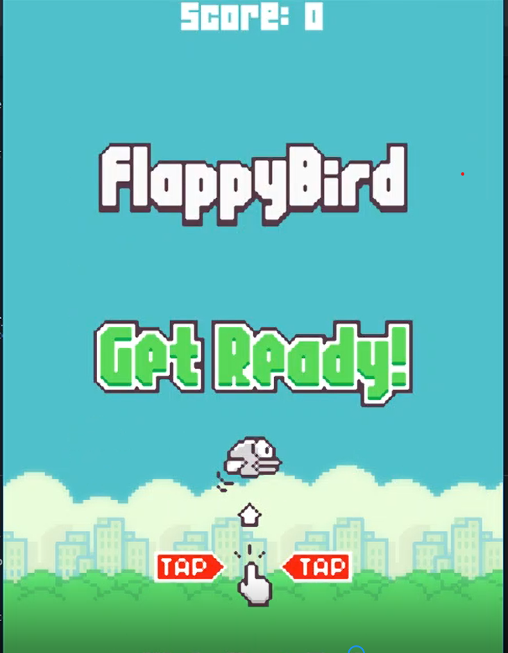
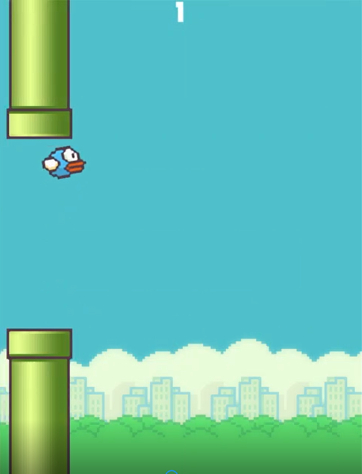

# Flappy_Bird

Made a Flappy bird like game using Pygame library and Python

### Languages and Tools

<!--  -->

<br>

#### installing libraries
```bash
pip install Pygame
```
PyPDF2 is a pure-python PDF library capable of splitting, merging together, cropping,<br>and transforming the pages of PDF files

### Breaking the code

Importing required modules 
```python  
import Pygame,sys,random
```

Creating the window screen
```python
pygame.init()
screen = pygame.display.set_mode((576,1024))
clock = pygame.time.Clock()
game_font = pygame.font.Font('04B_19.ttf',40)
```

draw the floor
```python
def draw_floor():
	screen.blit(floor_surface,(floor_x_pos,900))
	screen.blit(floor_surface,(floor_x_pos + 576,900))
```
move the floor
```python
floor_x_pos -= 1
draw_floor()
if floor_x_pos <= -576:
	floor_x_pos = 0
```

create and move pipes
```python
def create_pipe():
	random_pipe_pos = random.choice(pipe_height)
	bottom_pipe = pipe_surface.get_rect(midtop = (700,random_pipe_pos))
	top_pipe = pipe_surface.get_rect(midbottom = (700,random_pipe_pos - 300))
	return bottom_pipe,top_pipe

def move_pipes(pipes):
	for pipe in pipes:
		pipe.centerx -= 5
	visible_pipes = [pipe for pipe in pipes if pipe.right > -50]
	return visible_pipes
```
**You can change the size according to your screen size


For collision checking
```python
def check_collision(pipes):
	global can_score
	for pipe in pipes:
		if bird_rect.colliderect(pipe):
			death_sound.play()
			can_score = True
			return False

	if bird_rect.top <= -100 or bird_rect.bottom >= 900:
		can_score = True
		return False

	return True
```


### Screenshots from the game

<p align="center">
  <br>
  
</p>


### Submitted By
[Sitikanta Panigrahi](https://github.com/sitispeaks) 
